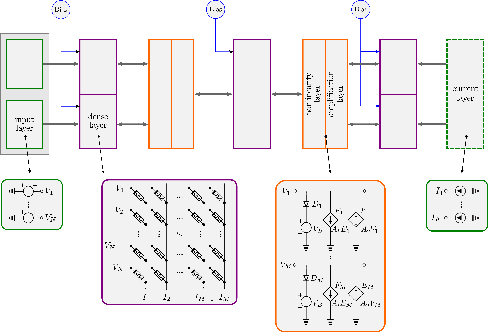

# EBANA

This repository contains the code of the framework presented in the paper
"Energy-Based Analog Neural Network Framework" that was accepted in 2022
edition of the [IEEE SOCC conference](https://www.ieee-socc.org/). A link to
the paper will be included as soon as the paper is made available on
[ieee.org](https://ieeexplore.ieee.org).

Please note that this repository is still heavily under construction. We plan to
include more examples on usage to demonstrate the flexibility of the framework.

## Introduction

EBANA (**E**nergy-**B**ased **Ana**log Neural Network Framework) is a deep
learning framework that can be used to train **analog neural networks** using
the Equilibrium Propagation algorithm. It is built in the spirit of Keras with
two goals in mind: ease-of-use and flexibility. By hiding the complexity
inherent to machine learning and analog electronics behind a simple and
intuitive API, the framework facilitates experimentation with different network
topologies and the exploration of the various tradeoffs that exist in the
design space.

For the Equilibrium Propagation algorithm, see this paper: https://arxiv.org/abs/1602.05179

## Installation

EBANA makes use of [Ngspice](http://ngspice.sourceforge.net/) for SPICE
simulation, and [PySpice](https://pypi.org/project/PySpice) for
interoperability between Python and Ngspice.

Assuming you already have `conda`
installed (for example, through
[miniconda](https://docs.conda.io/en/latest/miniconda.html)), the required
packages can be installed using the code below:

```bash
conda create -n ebana
conda activate ebana
conda install -c conda-forge pyspice
conda install -c conda-forge ngspice ngspice-lib
```

The next step is to make a clone of this repository:

```bash
git clone https://github.com/mawatfa/ebana.git
```

## Usage

The EBANA framework is largely made up of two parts: one for defining the
network model, and the other for training in the analog domain. A block diagram
of the framework is shown below.


The process of designing and training a model in EBANA starts with defining the
model. The general structure of an analog neural network that can be trained
with EBANA is shown below. It consists of an input layer, several hidden
layers, and an output layer. It looks similar to a regular neural network that
can be trained by the backpropagation algorithm except for two major
differences. First, the layers can influence each other bidirectionally.
Second, the output nodes are linked to current sources which serve to inject
loss gradient signals during training



An example of a topology that can be used to learn the `xor` dataset
is given below. The complete example for the `xor` training along with others
can found in the [test_circuit](./test_circuits) directory.

### Building the network topology

Constructing a neural network topology in EBANA follows the Keras syntax very
closely.

```python
# input layer
xp = InputVoltageLayer(units=input_units, name='xp', trainable=False)
xn = InputVoltageLayer(units=input_units, name='xn', trainable=False)
b1 = BiasVoltageLayer(units=1, name='b1', bias_voltage=bias1, trainable=False)
j1 = ConcatenateLayer(name='j1')([xp, xn, b1])

# hidden dense layer 1
d1 = DenseLayer(units=hidden_1_units, lr=0.0001, name='d1', init_type='glorot', trainable=True)(j1)
a1_1 = DiodeLayer(name='act1_1', direction='down', bias_voltage=a1_bias, trainable=False, use_mos=True, model=mos_model)(d1)
a1_2 = DiodeLayer(name='act1_2', direction='up', bias_voltage=-a1_bias, trainable=False, use_mos=True, model=mos_model)(a1_1)
g1 = AmplificationLayer(gain=4, name='amp1')(a1_2)

# layer before output
b2 = BiasVoltageLayer(units=1, name='b2', bias_voltage=bias2, trainable=False)
j2 = ConcatenateLayer(name='j2')([g1, b2])

# output layer
d_out = DenseLayer(units=2 * output_units, lr=0.0001, name='d_out', init_type='glorot', trainable=True)(j2)
c_out = CurrentLayer(name='xor')(d_out)

model = Model(inputs=[xp, xn, b1, b2], outputs=[c_out])
```

The network defined in the example above consists of four blocks:

1. The input block is where we provide the inputs to the model. Here, we have
   3 input sources: `xp`, `xn`, and `b1`.
   - For the `xor` dataset, we typically have a single input source. This is in
     the input source represented by `xp`.
   - However, in analog circuits, because the weights are represented by
     resistors (which are positive), a second set of input with the opposite
     polarity to the input source is added to the circuit to account for
     negative weights. This is the input source represented by `xn`.
   - Furthermore, it is usually beneficial in analog neural networks to set the
     bias to values other than 1. This is the input source represented by `b1`.
   - These three input sources are concatenated together and passed the next
     layer.

2. The second block is first hidden layer, comprising of a dense layer along
   with two nonlinearity layers, and an amplification layer.
   - The syntax of the dense layer follows closely that of Keras, except that,
     here, we can define a custom learning rate for each layer directly.
    - The nonlinearity is represented by two diode layers.
        - The voltage at which the diodes turn on can be controlled by passing
          a value to the parameter `bias_voltage`.
        - The direction of the anode and cathode of the diode can be controlled
          by passing a value to the parameter `direction`.
        - By default, an ideal diode is used. However, we can also pass in
          a SPICE model via the parameter `model`.
        - We can specify whether we want to use a transistor connected in
          a diode configuration by setting the `use_mos` parameter to `True`.
    - In analog circuits, it is useful to maintain the amplitude of the signal
      as it flows through the components. This is achieved with the
      amplification layer, where we have the option to set a custom `gain`.

3. The third block simple takes the output from the previous layer, adds
   a custom bias to it, and passes the result to the next layer.

4. The last block is the output block. It is represented by a dense layer. It
   is defined similarly to the dense layer in the hidden layer, except that the
   number of output nodes is doubled. This is to account for negative weights.
   Finally, a layer of current sources is attached to the output node whose
   purpose is to inject current into the circuit during the second phase of
   training. The injected current plays the role of the loss gradient in the
   backpropagation algorithm.

### Training the model

Training the model is almost exactly the same as in Keras. An example is shown
below.

```python
optimizer = optimizers.Adam(model)
#optimizer.load_state('digital_gates.pickle')

loss_fn = losses.MSE()
model.fit(train_dataloader, beta=0.001, epochs=100,
        loss_fn=loss_fn,
        optimizer=optimizer,
        test_dataloader=test_dataloader,
        validate_every = {'epoch_num': 20})

predictions = model.evaluate(test_dataset, loss_fn=loss_fn)
```

Three things need to be specified:

- **Optimizer**: at this stage, we can also load the optimizer state from
  a previous run in case we want to resume training or reuse some of the
  trained layers.
- **loss function**: such as the mean squared_error (`MSE`), binary cross
  entropy (`BCE`), or cross entropy (`CrossEntropyLoss`).
- **fit method**: Here, we specify the dataloaders for the training and test
  datasets, the optimizer, loss function, number of epochs, and after how many
  batches or epochs of training we would like to validate against the test
  dataset.

## Saving network state

Having trained the model, it is possible to save the weights, optimizer states,
loss history, test dataset accuracy, etc. This is done using the code below.

```python
optimizer.save_state('fashion_optimizer.pickle')
model.save_history('fashion_history.pickle')
```

## Creating custom analog blocks

New analog blocks can be easily created using PySpice. A short tutorial on the usage
of PySpice can be found [here](./docs/pyspice/PySpice.ipynb).
